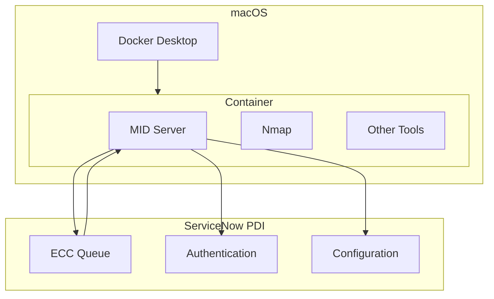
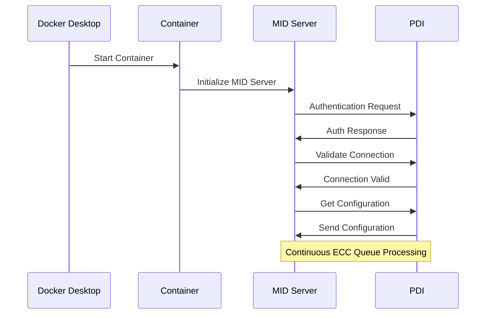
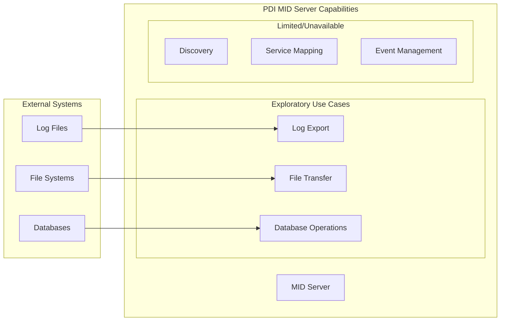

# Setting up a ServiceNow MID Server for your PDI (Personal Developer Instance)

## Introduction
This project configures a ServiceNow MID Server in a Docker container on macOS specifically for use with Personal Developer Instances (PDIs). We explore the capabilities and limitations of running MID Servers with PDIs making it a valuable learning resource for ServiceNow developers and administrators.

## Prerequisites
- ServiceNow Personal Developer Instance (PDI)
- Docker Desktop for Mac (Apple Silicon or Intel)
- macOS Monterey (12.0) or later
- At least 4GB of RAM available for Docker
- Basic knowledge of:
  - ServiceNow administration
  - Docker commands
  - Terminal/command line operations
- ServiceNow MID Server role and admin access in your PDI

## Quick Start
1. Clone this repository:
   ```bash
   git clone https://github.com/jschuller/sn-midserver.git
   cd sn-midserver
   ```

2. Set up environment variables:
   ```bash
   cp .env.template .env
   ```
   Edit `.env` with your PDI details:
   - MID_INSTANCE_URL (your PDI URL)
   - MID_INSTANCE_USERNAME (e.g. 'mid.server' user with roles: 'mid_server' 'itom_admin' and 'discovery_admin'))
   - MID_INSTANCE_PASSWORD (your MID server user password)
   - MID_SERVER_NAME (your chosen MID server name)

3. Build and run the container:
   ```bash
   docker build -t midserver .
   docker run -d --name servicenow-mid \
     --env-file .env \
     --restart unless-stopped \
     midserver
   ```

4. Verify the setup:
   ```bash
   # Check container status
   docker ps
   
   # View logs
   docker logs -f servicenow-mid
   ```

5. In your PDI:
   - Navigate to MID Server > Servers
   - Locate your MID Server
   - Validate the MID Server
   - Check status shows as "Up"

## Architecture Overview



## Container Startup Flow



## Troubleshooting Commands

```bash
# View container logs
docker logs servicenow-mid
docker logs -f servicenow-mid  # Follow logs in real-time

# Check container status
docker ps
docker ps -a  # Show all containers including stopped ones

# Container management
docker stop servicenow-mid
docker start servicenow-mid
docker restart servicenow-mid

# Access container shell
docker exec -it servicenow-mid /bin/bash

# Check MID Server logs directly
docker exec servicenow-mid cat /opt/snc_mid_server/agent/logs/agent0.log.0

# Monitor resource usage
docker stats servicenow-mid
```

## MID Server Capabilties



## Common ServiceNow ETL Scenarios

1. CMDB Data Integration
   - Import configuration items from external sources
   - Use Import Set Tables and Transform Maps
   - Leverage IntegrationHub ETL for data transformation
   - Schedule regular CMDB synchronization jobs

2. REST API Integration
   - Connect to external REST services via MID Server
   - Import data using Import Sets
   - Transform data using ETL Transform Maps
   - Set up scheduled data synchronization

3. Database Integration
   - Connect to external databases using JDBC
   - Import data into staging tables
   - Transform using Robust Transform Maps
   - Maintain data relationships and CI relationships

4. File-Based Integration
   - Monitor file system for new data
   - Process CSV, Excel, or XML files
   - Use Import Set Tables for staging
   - Transform data using Column Maps

## Mac OS Setup with Docker Desktop
We successfully adapted the ServiceNow MID Server Docker recipe for Mac OS by:

1. Adding platform specification for x86_64 emulation:
```dockerfile
FROM --platform=linux/amd64 eclipse-temurin:8-jdk-alpine AS pre_installation
```

2. Using the same platform specification in the final stage:
```dockerfile
FROM --platform=linux/amd64 almalinux:9.2
```

3. Container commands used:
```bash
docker build -t midserver .
docker run -d --name servicenow-mid \
  --env-file .env \
  --restart unless-stopped \
  midserver
```
4. Follow logs in real-time:
```
docker logs -f servicenow-mid
```


## PDI Limitations
Despite Nmap being properly installed and accessible, the MID Server reported:
```
MID Server mid.server.midserver-mcp is not a suitable MID because it does not have the following capabilities [{Capability: Nmap, value: null}]
```
We discovered several important limitations when using a MID Server with a PDI:

1. Discovery functionality is not available on PDIs
2. ITOM capabilities are disabled
3. Service Mapping features are not accessible
4. Event Management functions are not available


## Useful PDI Activities
While functionality is limited, you can still use a PDI MID Server for:
1. Learning basic MID Server setup and configuration
2. Testing basic MID Server communications
3. Practicing MID Server administration tasks
4. Understanding configuration structures
5. Studying table relationships

## Cleanup Instructions

### Stop and Remove MID Server Container
```bash
# Stop the container
docker stop servicenow-mid

# Remove the container
docker rm servicenow-mid

# Remove the container image
docker rmi midserver
```

### Clean Docker System
```bash
# Remove unused containers, networks, and dangling images
docker system prune -f

# Remove all unused images (not just dangling ones)
docker system prune -a -f

# Check no containers remain
docker ps -a
```

### Cleanup ServiceNow PDI
1. Navigate to MID Server > Servers
2. Find your MID Server
3. Delete the MID Server record
5. Remove MID Server user from PDI or reset its password if reusing the instance

## Future Exploration Areas
Potential areas for further investigation:
1. Understanding how ServiceNow validates and enables MID Server capabilities
2. Exploring alternative environments for full ITOM testing
3. Using PDIs for data structure analysis and ETL planning
4. Investigating MID Server security and encryption mechanisms

## For Real ITOM Work
For actual ITOM tasks, use:
- Production instance
- Sub-production instance (dev/test/staging)
- Dedicated ITOM training instance
- ServiceNow trial or demo environment with ITOM enabled

## Additional Resources
- ServiceNow Product Documentation
- Now Learning platform for hands-on labs
- ServiceNow Developer portal
- Official certification preparation resources