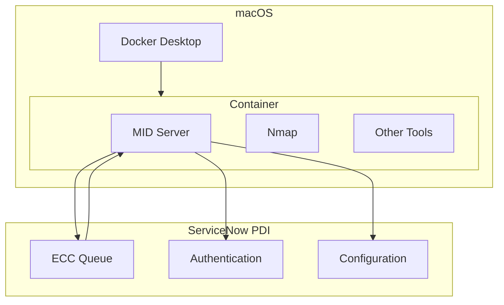
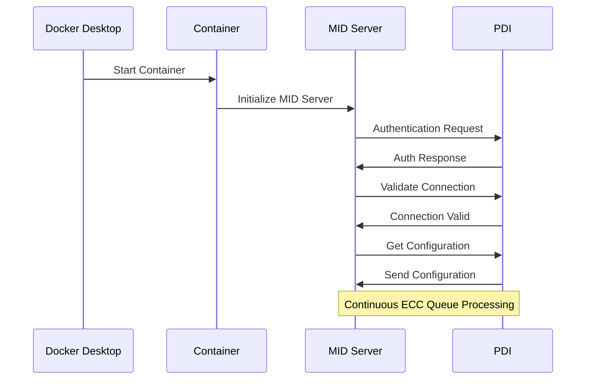

# Setting up a ServiceNow MID Server for your PDI (Personal Developer Instance)

## Introduction
This project repository is a ServiceNow community resource demonstrating how to configure a containerized ServiceNow MID Server with Personal Developer Instances (PDIs). 

Please also refer to official training materials such as those listed in the [Additional Resources](#additional-resources).

## Prerequisites
- ServiceNow Personal Developer Instance (PDI)
- Docker Desktop for Mac (Apple Silicon or Intel)
- macOS Monterey (12.0) or later
- At least 4GB of RAM available for Docker
- Basic knowledge of:
  - ServiceNow administration
  - Docker commands
  - Terminal/command line operations
- ServiceNow MID Server role and admin access in your PDI

## Quick Start
1. Clone this repository:
   ```bash
   git clone https://github.com/jschuller/sn-midserver.git
   cd sn-midserver
   ```

2. Set up environment variables:
   ```bash
   cp .env.template .env
   ```
   Edit `.env` with your PDI details:
   - MID_INSTANCE_URL (your PDI URL)
   - MID_INSTANCE_USERNAME (e.g. 'mid.server' user with roles: 'mid_server' 'itom_admin' and 'discovery_admin'))
   - MID_INSTANCE_PASSWORD (your MID server user password)
   - MID_SERVER_NAME (your chosen MID server name)

3. Build and run the container:
   ```bash
   docker build -t midserver .
   docker run -d --name servicenow-mid \
     --env-file .env \
     --restart unless-stopped \
     midserver
   ```

4. Verify the setup:
   ```bash
   # Check container status
   docker ps
   
   # View logs in real-time
   docker logs -f servicenow-mid
   ```

5. In your PDI:
   - Navigate to MID Server > Servers
   - Locate your MID Server
   - Validate the MID Server
   - Check status shows as "Up"


## Cleanup Instructions

1. Stop and Remove MID Server Container
    ```bash
    # Stop the container
    docker stop servicenow-mid

    # Remove the container
    docker rm servicenow-mid

    # Remove the container image
    docker rmi midserver
    ```

2. Clean local Docker System
    ```bash
    # Remove unused containers, networks, and dangling images
    docker system prune -f

    # Remove all unused images (not just dangling ones)
    docker system prune -a -f

    # Check no containers remain
    docker ps -a
    ```

3. Cleanup ServiceNow PDI
   1. Navigate to MID Server > Servers
   2. Find your MID Server
   3. Delete the MID Server record
   4. Remove MID Server user from PDI or reset its password if reusing the instance


## Architecture Overview



## Container Startup Flow



## Troubleshooting Commands

```bash
# View container logs
docker logs servicenow-mid
docker logs -f servicenow-mid  # Follow logs in real-time

# Check container status
docker ps
docker ps -a  # Show all containers including stopped ones

# Container management
docker stop servicenow-mid
docker start servicenow-mid
docker restart servicenow-mid

# Access container shell
docker exec -it servicenow-mid /bin/bash

# Check MID Server logs directly
docker exec servicenow-mid cat /opt/snc_mid_server/agent/logs/agent0.log.0

# Monitor resource usage
docker stats servicenow-mid
```


## Additional Resources
- ServiceNow Product Documentation 
  - https://www.servicenow.com/docs/csh?topicname=mid-server-landing.html&version=latest
- Now Learning platform and hands-on labs
  - https://nowlearning.servicenow.com/lxp/en/pages/lxp-search?id=search&q=MID%20Server&spa=1
- ServiceNow Developer portal
  - https://developer.servicenow.com/dev.do#!/guides/xanadu/now-platform/tpb-guide/logs_and_queues_best_practices