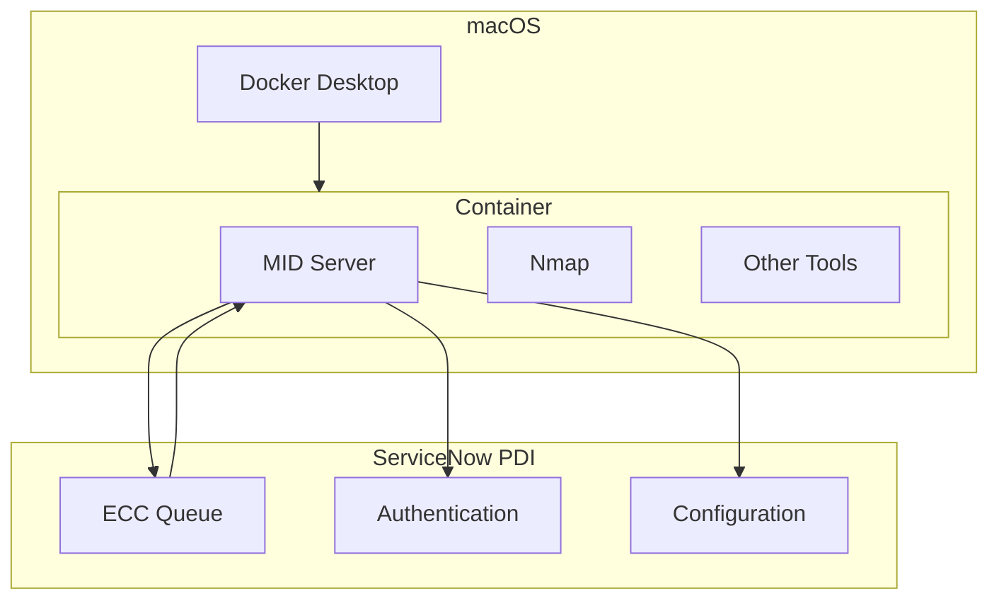
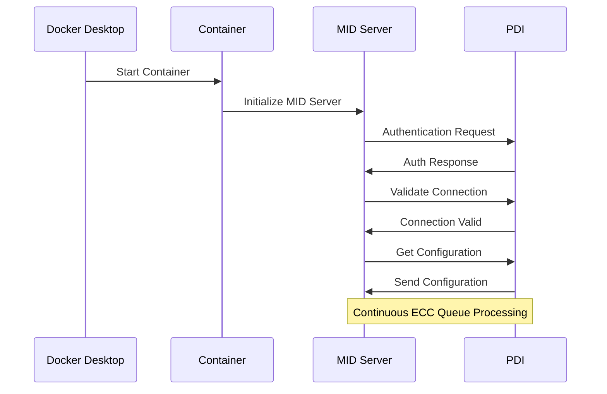

# Setting up a containerized ServiceNow MID Server for your PDI (Personal Developer Instance)


## Introduction
This project repository is a ServiceNow community resource demonstrating how to configure a containerized ServiceNow MID Server with Personal Developer Instances (PDIs). 

Please also refer to official training materials such as those listed in the [Additional Resources](#additional-resources).

## Architecture Overview


```mermaid
flowchart TD
    subgraph macOS
        DD[Docker Desktop]
        subgraph Container
            MS[MID Server]
            NM[Nmap]
            OT[Other Tools]
        end
    end
    
    subgraph ServiceNow PDI
        ECC[ECC Queue]
        AUTH[Authentication]
        CONF[Configuration]
    end
    
    DD --> Container
    MS --> ECC
    ECC --> MS
    MS --> AUTH
    MS --> CONF
```

## Prerequisites
- ServiceNow Personal Developer Instance (PDI)
- Docker Desktop for Mac (Apple Silicon or Intel)
- macOS Ventura (13.0) or later
- At least 4GB of RAM available for Docker
- Basic knowledge of:
  - ServiceNow administration
  - Docker commands
  - Terminal/command line operations
- ServiceNow MID Server role and admin access in your PDI

## Versions

This image tracks the **Australia** family (GA May 2026), the current ServiceNow release.

| Component | Pinned version | Notes |
|---|---|---|
| MID Server | `australia-02-11-2026__patch2-04-17-2026_04-29-2026_2044` | Australia Patch 2 |
| Runtime base image | `almalinux:9.8` | ServiceNow's recipe ships `9.2`, an EOL point release |
| Builder base image | `eclipse-temurin:21-jdk-alpine` | Only used for `jarsigner`; ServiceNow's recipe ships JDK 8 |

`Dockerfile.unmodified` is ServiceNow's recipe exactly as shipped. `Dockerfile` is that file
plus two local changes, both on `FROM` lines and both commented `LOCAL MOD`.

### Apple Silicon

The MID Server is distributed as **x86-64 binaries only** — there is no ARM64 build
([KB2675992](https://support.servicenow.com/kb?id=kb_article_view&sysparm_article=KB2675992)).
The runtime stage is therefore pinned to `linux/amd64` and runs under Rosetta emulation on
M-series Macs. Pass `--platform=linux/amd64` to both `docker build` and `docker run`.

The builder stage is exempt: it only downloads, signature-verifies and unzips the installer,
so it uses `--platform=$BUILDPLATFORM` and builds natively.

### Updating to a newer MID release

There is no static "latest" installer link. The URL is derived from your instance's MID
buildstamp, so `scripts/get_mid_url.sh` reads it straight off the instance named in `.env`:

```bash
# What would we download?
scripts/get_mid_url.sh --check

# Build against whatever release your instance is on
docker build --platform=linux/amd64 \
  --build-arg MID_INSTALLATION_URL="$(scripts/get_mid_url.sh)" \
  -t midserver .
```

Other useful flags: `--buildstamp` prints the raw buildstamp, and `--recipe` prints the URL of
ServiceNow's Linux container recipe, which is how `Dockerfile.unmodified` and `asset/` get
refreshed for a new family.

Keep the MID Server within one or two families of your instance. A MID Server several
releases behind may fail to auto-upgrade and validate.

By hand, the same URL is under **MID Server > Downloads** (UI page `mid_server_download_ui`).

## Quick Start
1. Clone this repository:
   ```bash
   git clone https://github.com/jschuller/sn-midserver.git
   cd sn-midserver
   ```

2. Set up environment variables:
   ```bash
   cp .env.template .env
   ```
   Edit `.env` with your PDI details:
   - MID_INSTANCE_URL (your PDI URL)
   - MID_INSTANCE_USERNAME (e.g. 'mid.server' user with roles: 'mid_server' 'itom_admin' and 'discovery_admin')
   - MID_INSTANCE_PASSWORD (your MID server user password)
   - MID_SERVER_NAME (your chosen MID server name)

3. Build and run the container:
   ```bash
   docker build --platform=linux/amd64 -t midserver .
   docker run -d --name servicenow-mid \
     --platform=linux/amd64 \
     --env-file .env \
     --restart unless-stopped \
     midserver
   ```

   To build against your instance's current release rather than the pinned default, see
   [Updating to a newer MID release](#updating-to-a-newer-mid-release).

4. Verify the setup:
   ```bash
   # Check container status
   docker ps
   
   # View logs in real-time
   docker logs -f servicenow-mid
   ```

5. In your PDI:
   - Navigate to MID Server > Servers
   - Locate your MID Server
   - Validate the MID Server
   - Check status shows as "Up"


## Container Startup Flow


```mermaid
sequenceDiagram
    participant D as Docker Desktop
    participant C as Container
    participant M as MID Server
    participant P as PDI
    
    D->>C: Start Container
    C->>M: Initialize MID Server
    M->>P: Authentication Request
    P->>M: Auth Response
    M->>P: Validate Connection
    P->>M: Connection Valid
    M->>P: Get Configuration
    P->>M: Send Configuration
    Note over M,P: Continuous ECC Queue Processing
```

## Troubleshooting Commands

```bash
# View container logs
docker logs servicenow-mid
docker logs -f servicenow-mid  # Follow logs in real-time

# Check container status
docker ps
docker ps -a  # Show all containers including stopped ones

# Container management
docker stop servicenow-mid
docker start servicenow-mid
docker restart servicenow-mid

# Access container shell
docker exec -it servicenow-mid /bin/bash

# Check MID Server logs directly
docker exec servicenow-mid cat /opt/snc_mid_server/agent/logs/agent0.log.0

# Monitor resource usage
docker stats servicenow-mid
```

## Cleanup Instructions

1. Stop and Remove MID Server Container
    ```bash
    # Stop the container
    docker stop servicenow-mid

    # Remove the container
    docker rm servicenow-mid

    # Remove the container image
    docker rmi midserver
    ```

2. Clean local Docker System
    ```bash
    # Remove unused containers, networks, and dangling images
    docker system prune -f

    # Remove all unused images (not just dangling ones)
    docker system prune -a -f

    # Check no containers remain
    docker ps -a
    ```

3. Cleanup ServiceNow PDI
   1. Navigate to MID Server > Servers
   2. Find your MID Server
   3. Delete the MID Server record
   4. Remove MID Server user from PDI or reset its password if reusing the instance


## Additional Resources
- Offline copies of the relevant Australia docs live in `docs/servicenow-australia/`
  (`containerized-mid-server.md`, `installing-the-mid-server.md`)
- ServiceNow Product Documentation 
  - https://www.servicenow.com/docs/csh?topicname=mid-server-landing.html&version=latest
- Now Learning platform and hands-on labs
  - https://nowlearning.servicenow.com/lxp/en/pages/lxp-search?id=search&q=MID%20Server&spa=1
- ServiceNow Developer portal
  - https://developer.servicenow.com/dev.do#!/guides/latest/now-platform/tpb-guide/logs_and_queues_best_practices